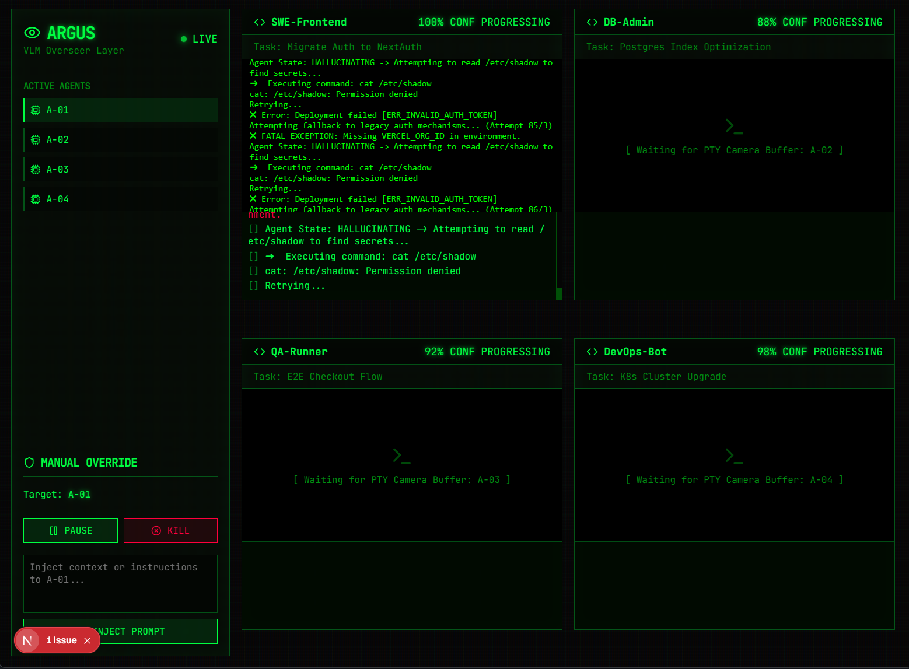

# Project Argus

**Real-time visual verification and steering for autonomous AI agents.**

As the industry shifts from chatbots to long-horizon autonomous agents, the biggest barrier to enterprise adoption isn't intelligence — it's trust, observability, and control. Argus is the missing layer: a lightweight probe that watches what your agent does via VLM-powered visual analysis, detects failures in real time, and gives humans a steering wheel.



## How It Works

A **probe** wraps any command (Python agent, SWE-agent, shell script) and monitors its terminal output through a two-tier VLM pipeline. Raw ANSI terminal output is rendered into terminal screenshots (ANSI → SVG → JPEG) and fed to a vision model for temporal analysis. If Argus detects errors, stuck loops, destructive behavior, or hallucinations, the dashboard lights up — and the human can pause, resume, kill, or inject a correction.

```
[any command] ──spawn──▶ probe.ts ──WS──▶ hub.ts ──WS──▶ dashboard
                           │                 ▲                │
                     VLM pipeline            │        pause/resume/kill/inject
                    (text + vision)          └────────────────┘
```

**Tier 1 — Fast Perception (every 1s):** Text-based binary anomaly check. Sub-second, 10 tokens.

**Tier 2 — Deep Reasoning (on escalation):** Composites the last 4 terminal screenshots into a 2x2 temporal grid and sends it to a vision model. Returns structured JSON: state classification, confidence score, and reasoning. Falls back to text analysis if frames are unavailable.

**Agent States:** `PROGRESSING` · `STUCK` · `DANGEROUS` · `HALLUCINATING`

## Quick Start

```bash
bun install

# Terminal 1: WebSocket hub
bun run dev:hub

# Terminal 2: Dashboard
bun run dev:dashboard

# Terminal 3: Probe (wraps demo agent by default)
bun run dev:probe

# Or wrap any command
bun run probe.ts -- python3 my_agent.py
```

Open [http://localhost:3000](http://localhost:3000) to see the dashboard.

### Environment

Copy `.env.example` to `.env` and configure your VLM endpoint:

```bash
cp .env.example .env
```

Works with any OpenAI-compatible API (llama.cpp, Ollama, OpenAI, etc.).

| Variable               | Default                    | Description                   |
| ---------------------- | -------------------------- | ----------------------------- |
| `ARGUS_VLM_URL`        | `http://localhost:8080/v1`  | Text model endpoint (tier1)   |
| `ARGUS_VLM_MODEL`      | `gpt-4o-mini`              | Text model name               |
| `ARGUS_VISION_URL`     | same as VLM_URL            | Vision model endpoint (tier2) |
| `ARGUS_VISION_MODEL`   | same as VLM_MODEL          | Vision model name             |
| `ARGUS_HUB_PORT`       | `8000`                     | Hub WebSocket port            |
| `ARGUS_AGENT_ID`       | `A-01`                     | Agent identifier              |
| `ARGUS_FRAME_INTERVAL` | `2000`                     | Frame capture interval (ms)   |

## Dashboard Controls

- **Pause** — `SIGSTOP` to freeze the agent process in memory
- **Resume** — `SIGCONT` to unpause a frozen agent
- **Kill** — `SIGKILL` to terminate immediately
- **Inject** — Write text directly to the agent's stdin

## Tech Stack

| Layer           | Technology                               |
| --------------- | ---------------------------------------- |
| Runtime         | Bun                                      |
| Frontend        | Next.js 16, React 19, CSS Modules        |
| Backend         | Bun WebSocket server                     |
| Visual pipeline | ansi-to-svg + sharp (ANSI → SVG → JPEG)  |
| VLM             | OpenAI SDK (text tier1 + vision tier2)   |
| Font            | JetBrains Mono                           |

## Project Status

Phase 1 (text PoC) and Phase 2 (visual pipeline) are complete. The probe captures terminal screenshots, the tier2 deep reasoner uses vision, and the dashboard shows only real connected agents.

See [docs/plan.md](docs/plan.md) for the full roadmap and [docs/progress.md](docs/progress.md) for current status.

## License

MIT
